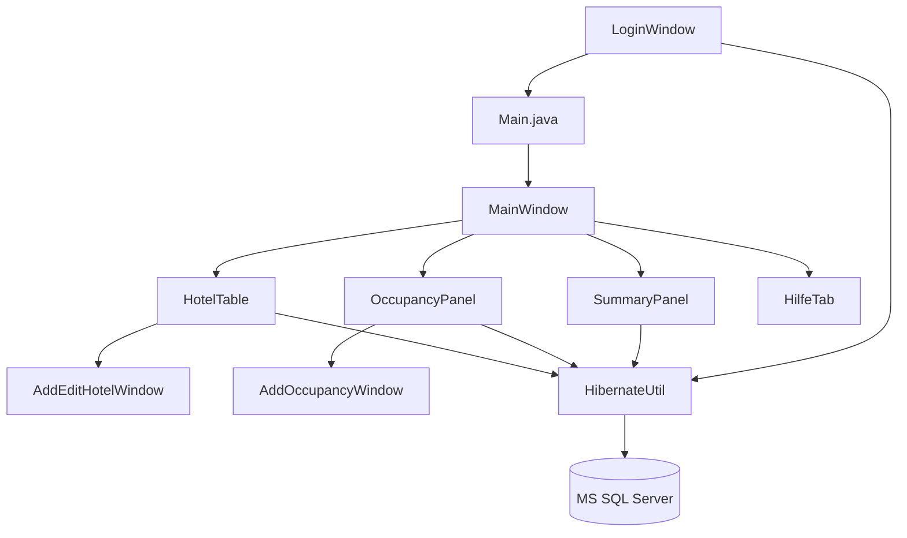
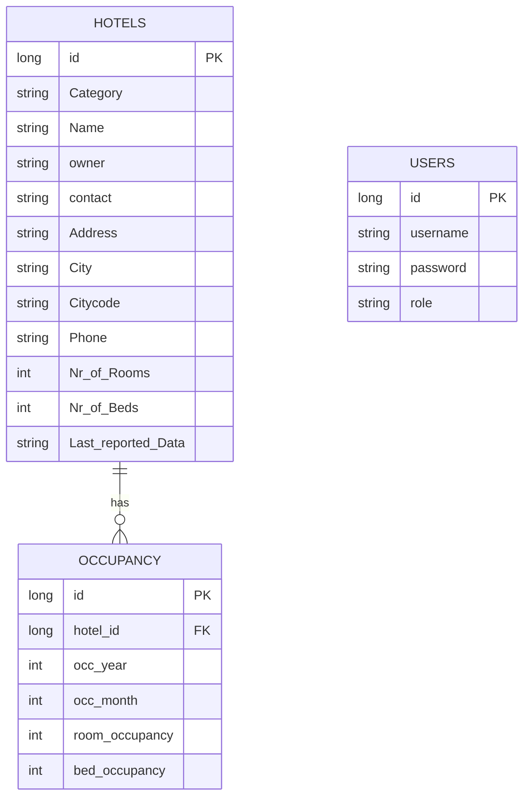

# Technical Documentation - NOE Hotels (Lower Austria Tourist Portal)

This document serves as the technical documentation for the **NOE-Hotels** project, developed as part of the *Project Management Cycle* course in the summer semester 2026.

---

## 1. General Project Information

### Project Overview
- **Software Name:** NOE-Hotels (Lower Austria Tourist Portal)
- **Purpose/Goal:** Management of hotel master data and occupancy statistics for the NOE-Tourism Office GmbH (NOE-TO).
- **Description:** A Java-based desktop application with a Swing GUI and Hibernate/SQL Server integration for managing hotel master data, monthly occupancy data, user authentication, and statistical summaries.
- **Target Audience:** Senior users of NOE-TO, administrators (Admin role), and hotel representatives.
- **Problem Solved:** Replaces the outdated legacy application (Java 8, File I/O) with a modern, database-backed solution including role-based access control, filtering, sorting, and PDF export capabilities.
- **Project Status:** In Progress
- **Version:** 1.0-SNAPSHOT
- **Release Date:** July 1st, 2026 (planned go-live)
- **Responsible Team:** Students of the PMCY Summer Term 2026 course, FH BFI Vienna.

### Changelog
- **v0.1:** Initial project structure, Maven setup, Hibernate configuration.
- **v0.2:** Hotel entity, TXT import (`hotels.txt`), basic JTable display (US-3, US-4).
- **v0.3:** Add/Edit Hotel dialog (`AddEditHotelWindow`), Hibernate CRUD (US-4, US-5).
- **v0.4:** Occupancy entity, Add Occupancy dialog, filter functionality (US-2, US-6, US-10).
- **v0.5:** Summary panel with category statistics (US-1), sorting and search (TableUtils).
- **v0.6:** Login system with role-based access control (`LoginWindow`, `UsersHibernate`, `UserRole`) (US-12).
- **v0.7:** Delete Hotel with cascade delete of linked occupancy data (US-11), logo header (US-17), help tab (US-18).
- **v0.8:** PDF export of filtered occupancy statistics (US-7), `PdfExporter` class with NOE-TO branding, multi-page support.

---

## 2. System Architecture

### Architecture Overview
The system follows a **layered model** (N-Tier), separating the user interface (Swing), business logic, and data access (Hibernate/JPA).

- **Architecture Model:** Desktop Client (Monolithic) with an external MS SQL Server database.
- **Component Overview:**
  - **GUI Layer:** Swing components (`JFrame`, `JDialog`, `JPanel`, `JTable`, `JTabbedPane`).
  - **Logic Layer:** Panel and window classes containing validation, filtering, and CRUD logic.
  - **Data Layer:** Hibernate ORM mapping Java entities to SQL Server tables.

### Technologies and Frameworks
| Technology | Version | Purpose |
|---|---|---|
| Java | 25 | Programming language |
| Java Swing | - | Desktop GUI framework |
| Hibernate ORM | 6.6.34.Final | Object-Relational Mapping |
| Jakarta Persistence API | 3.1.0 | JPA annotations |
| MS SQL Server JDBC | 12.6.4.jre11 | Database driver |
| Lombok | 1.18.44 | Boilerplate reduction (@Data, @Builder) |
| Apache Commons CSV | 1.10.0 | CSV/TXT import |
| Apache PDFBox | 2.0.31 | PDF export (US-7) |
| SLF4J Simple | 2.0.12 | Logging |
| Maven | - | Build tool |

### Architecture Diagram (Mermaid)


### Data Flow
1. Application starts → `HibernateUtil` initializes `SessionFactory`.
2. `LoginWindow` opens → user enters credentials → Hibernate queries `Users` table.
3. On successful login → `MainWindow` opens with the logged-in user's role.
4. User interacts with tabs (Summary, Hotels, Occupancy) → data is read from/written to the database via Hibernate sessions.
5. Role-based access: `ADMIN` can add/edit/delete; `SENIOR` can only view and filter.

---

## 3. Technical Requirements

### Hardware Requirements
- **Processor:** Dual-Core 2.0 GHz or higher.
- **RAM:** 8 GB minimum, 16 GB recommended.
- **Storage:** 500 MB free disk space.
- **Network:** Persistent internet/VPN connection for remote MS SQL Server access.

### Software Requirements
- **Operating System:** Windows 10/11, macOS, or Linux.
- **JDK:** Java Development Kit 25 or higher.
- **IDE:** IntelliJ IDEA (recommended) with Lombok plugin and Annotation Processing enabled.
- **Database:** Access to MS SQL Server (via VPN or public IP).
- **Build Tool:** Maven 3.x.

---

## 4. Installation and Configuration

### Build and Run
1. Clone the repository from GitHub (`SophieEich/Austours`).
2. Open the project in IntelliJ IDEA.
3. Enable **Annotation Processing**: `File → Settings → Build → Compiler → Annotation Processors → Enable`.
4. Run `mvn clean install` to load all dependencies.
5. Configure the database connection in `src/main/resources/hibernate.cfg.xml`.
6. Start the application via `MasterTable.Main`.

### Database Configuration
The connection is configured in `src/main/resources/hibernate.cfg.xml`:
- Set `hibernate.connection.url` to the MS SQL Server connection string.
- Set `hibernate.connection.username` and `hibernate.connection.password`.
- `hibernate.hbm2ddl.auto` is set to `update` — tables are created/updated automatically.

### Initial Data Setup
If the `Hotels` table is empty on startup, the application automatically imports data from `src/main/resources/hotels.txt` (`importIfEmpty()` in `HotelTable`).

User accounts must be created manually in SQL Server:
```sql
INSERT INTO Users (username, password, role) VALUES ('senior', 'senior', 'SENIOR');
INSERT INTO Users (username, password, role) VALUES ('admin', 'admin', 'ADMIN');
```

---

## 5. Usage Documentation

### Login
- On startup, the `LoginWindow` appears.
- Enter username and password — credentials are validated against the `Users` table in the database.
- After successful login, the `MainWindow` opens. The logged-in user and their role are displayed in the top-right corner of the header.

### Main Functions

| Feature | Description | US | Role |
|---|---|---|---|
| Summary | Category statistics (count, avg rooms, avg beds) | US-1 | All |
| Hotel List | Sortable, filterable table of all hotels | US-4 | All |
| Add Hotel | Form dialog to create a new hotel entry | US-3 | Admin |
| Edit Hotel | Pre-filled form dialog to update hotel data | US-5 | Admin |
| Delete Hotel | Deletes hotel and all linked occupancy data | US-11 | Admin |
| Occupancy List | Filterable list of monthly room/bed occupancy | US-2, US-10 | All |
| Add Occupancy | Form to enter monthly occupancy data per hotel | US-6 | Admin |
| Search | Real-time text search by hotel name | US-4 | All |
| Sort | Column header click sorts the table | - | All |
| Reset Sort | Button to restore original sort order | - | All |
| Export PDF | Exports filtered occupancy table as A4 PDF with NOE-TO branding | US-7 | All |
| Login/User Mgmt | Role-based access control (Admin/Senior) | US-12 | - |
| Help Tab | Usage instructions for all user types | US-18 | All |
| Logo Header | NOE-TO logo displayed in the application header | US-17 | All |

### Role Permissions

| Action | SENIOR | ADMIN |
|---|---|---|
| View all data | ✅ | ✅ |
| Filter & search | ✅ | ✅ |
| Add Hotel | ❌ | ✅ |
| Edit Hotel | ❌ | ✅ |
| Delete Hotel | ❌ | ✅ |
| Add Occupancy | ❌ | ✅ |

---

## 6. API Documentation
*The project does not use REST APIs. All communication occurs via Hibernate sessions and Java method calls internally.*

---

## 7. Database Documentation

### Data Model

#### Entities

**Hotel** (`hotels` table)
| Field | Column | Type | Notes |
|---|---|---|---|
| id | id | Long | Primary Key, auto-generated |
| category | Category | String | e.g. `*****`, `****` |
| name | Name | String | Hotel name |
| owner | owner | String | Owner name |
| contact | contact | String | Contact person |
| address | Address | String | Street address |
| city | City | String | City |
| cityCode | Citycode | String | Postal code |
| phone | Phone | String | Phone number |
| noRooms | [Nr of Rooms] | Integer | Total number of rooms |
| noBeds | [Nr of Beds] | Integer | Total number of beds |
| lastReported | [Last reported Data] | String | Date of last data update |
| occupancies | - | List\<Occupancy\> | OneToMany, CascadeType.REMOVE |

**Occupancy** (`Occupancy` table)
| Field | Column | Type | Notes |
|---|---|---|---|
| id | id | Long | Primary Key, auto-generated |
| hotel | hotel id | Hotel | ManyToOne, FetchType.EAGER |
| year | occ year | int | Year of occupancy |
| month | occ month | int | Month of occupancy |
| roomOccupancy | room occupancy | int | Number of occupied rooms |
| bedOccupancy | bed occupancy | int | Number of occupied beds |

**UsersHibernate** (`Users` table)
| Field | Column | Type | Notes |
|---|---|---|---|
| id | id | Long | Primary Key, auto-generated |
| username | username | String | Unique, not null |
| password | password | String | Not null |
| role | role | UserRole | Enum: SENIOR, ADMIN |

#### ER Diagram (Mermaid)


### Hibernate Configuration
- `HibernateUtil` provides a singleton `SessionFactory`.
- Registered entities: `Hotel`, `Occupancy`, `UsersHibernate`.
- All Hibernate logging is suppressed via SLF4J system properties for cleaner console output.

---

## 8. Class Overview

| Class | Package | Purpose |
|---|---|---|
| `Main` | `MasterTable` | Application entry point, initializes Hibernate and opens LoginWindow |
| `MainWindow` | `MasterTable` | Main JFrame with tabbed pane and logo header |
| `HotelTable` | `MasterTable` | JPanel showing hotel list with add/edit/delete/search/sort |
| `AddEditHotelWindow` | `MasterTable` | JDialog for adding or editing a hotel |
| `OccupancyPanel` | `MasterTable` | JPanel showing occupancy data with filters |
| `AddOccupancyWindow` | `MasterTable` | JDialog for adding occupancy data |
| `SummaryPanel` | `MasterTable` | JPanel showing category statistics |
| `HilfeTab` | `MasterTable` | JPanel with help/usage text (US-18) |
| `Hotel` | `MasterTable` | Hibernate entity for hotel master data |
| `Occupancy` | `MasterTable` | Hibernate entity for monthly occupancy data |
| `Category` | `MasterTable` | Enum for hotel star categories |
| `HibernateUtil` | `MasterTable` | Singleton SessionFactory provider |
| `TableUtils` | `MasterTable` | Utility class for sorting, filtering, and resetting JTables |
| `PdfExporter` | `MasterTable` | Exports filtered occupancy table as A4 PDF with NOE-TO branding, multi-page support, filter context (US-7) |
| `LoginWindow` | `MasterTable.Login` | JDialog for user authentication |
| `UsersHibernate` | `MasterTable.Login` | Hibernate entity for user accounts |
| `UserRole` | `MasterTable.Login` | Enum: SENIOR, ADMIN |